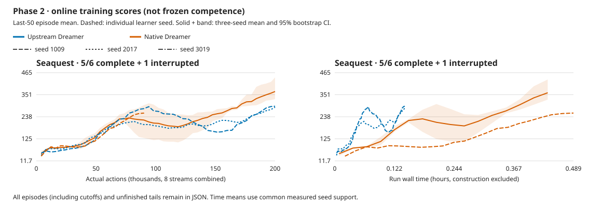

# Phase 2 matched learning comparison

[All curves, episodes, tails and configurations](2026-09-30-small-replication-learning.json).

Online training scores, not frozen competence. Final scores use the last 50 completed
episodes per seed (or all if fewer); 95% intervals resample learner seeds, not episodes.

Partial groups list individual seeds; no aggregate or uncertainty is reported until all three finish.

| Method | Game | Seeds | Final score [95% CI] | Human-normalized |
| --- | --- | ---: | ---: | ---: |
| learned_cnn | Seaquest | 2 | 1009: 328.800; 2017: 334.800 | — |
| upstream | Seaquest | 1 | 1009: 292.400 | — |

Human normalization uses [pinned upstream anchors](https://github.com/danijar/dreamerv3/blob/e3f02248693a79dc8b0ebd62c93683888ddaccfe/baselines.yaml); 1 is the reference human, not mastery.

- online last-50 completed episode means, not frozen competence.
- every episode and unfinished tail is retained; cutoffs are not silently removed.
- equal learner-seed weighting, 10000 percentile bootstrap samples; only three seeds.
- time starts before initial policy/encoding; construction is reported separately.
- time curves interpolate only within common measured support, never extrapolate.
- faithful RGB64 control; shared recipe, not identical RNG/replay or policy synchronization.
- smaller capacity/replay ratio/BPTT is not an unchanged-learning speedup.
- this comparison does not test JEPA.
- a complete learning matrix still needs offline evidence and an explicit architecture decision.

## Timing and pilot evidence

| Method | Seed | First20 score | Last50 score | Run + construction seconds | Actions/s | Per-stream real time |
| --- | ---: | ---: | ---: | ---: | ---: | ---: |
| learned_cnn | 1009 | 83.00 | 328.80 | 1569.60 + 5.36 | 127.42 | 1.06x |
| learned_cnn | 2017 | 75.00 | 334.80 | 1622.18 + 5.29 | 123.29 | 1.03x |
| upstream | 1009 | 57.00 | 292.40 | 516.71 + 39.70 | 387.06 | 3.22x |

**3 completed; 4/10 attempts used.** Incomplete attempts are not inferred to be running; the PR records live execution.
First20 versus last50 is descriptive within a changing policy, not an independent-seed significance test.
All completed guards/checkpoints/counters pass. Vulkan headroom is estimated; JAX reserves a 50% pool.
GPU utilization is unmeasured. Lower replay ratio/model size/BPTT is a new recipe, not a port optimization gain.
[Protocol](../experiments/2026-09-30-small-replication.md) · [Numerical checks](2026-09-30-small-dreamer-replication.md).

The successful seed1009 pair takes **35m31s including construction**, meeting the sub-hour screening target.
The interrupted pilot adds29 minutes separately. Both successful runs complete200,000 actions /49,939 updates with zero debt.
These rising online curves qualify the recipe for further seeds, not a statistically established native advantage.

## Retained attempt2: throughput qualification failed

Stopped early at **90,264 actions / 22,505 updates** after **1759.31s**: sustained **51.31 actions/s** projects beyond the declared one-hour deadline.
The direct worker handled SIGTERM, saved its checkpoint and exited zero. Guard/seal, complete-prefix trajectories/counters and finite-checkpoint audits pass.
The controller correctly fails its200,000-action completion check. This is an operator stop, not a GPU/kernel fault or a completed matched learning run.
All120 completed episodes and unfinished tails remain in JSON; final online last50 score is257.60 at this **smaller interaction budget**.
The interrupted prefix is shown separately and excluded from completed-run aggregates. Its29 minutes and one attempt still count.
The subsequent [profile and split-reduction qualification](2026-09-30-small-rgb-profile.md) addresses that bottleneck. Any replacement starts fresh; no deadline or action budget was relaxed.
