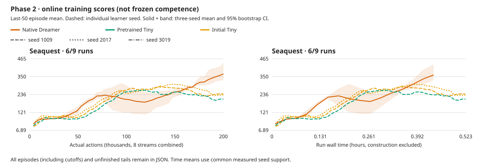

# Phase 2 matched learning comparison

All six new runs are complete. The [frontend decision](2026-10-01-frontend-decision.md)
combines these results with offline probes and verified implementation; the
learning auditor alone does not declare Phase 2 complete.

[All curves, episodes, tails and configurations](2026-10-01-small-jepa-learning.json).

Online training scores, not frozen competence. Final scores use the last 50 completed
episodes per seed (or all if fewer); 95% intervals resample learner seeds, not episodes.

Partial groups list individual seeds; no aggregate or uncertainty is reported until all three finish.

| Method | Game | Seeds | Final score [95% CI] | Human-normalized |
| --- | --- | ---: | ---: | ---: |
| initial_tiny | Seaquest | 3 | 230.667 [218.800, 239.200] | 0.0039 |
| learned_cnn | Seaquest | 3 | 368.000 [328.800, 440.400] | 0.0071 |
| pretrained_tiny | Seaquest | 3 | 225.333 [206.800, 258.000] | 0.0037 |

Paired final-score differences (candidate minus control): resample the three learner-seed pairs,
not episodes or independent method means. Small-seed intervals remain coarse.

| Candidate − control | Game | Difference [95% CI] |
| --- | --- | ---: |
| pretrained_tiny − learned_cnn | Seaquest | -142.667 [-229.200, -76.800] |
| pretrained_tiny − initial_tiny | Seaquest | -5.333 [-32.400, 24.000] |

Human normalization uses [pinned upstream anchors](https://github.com/danijar/dreamerv3/blob/e3f02248693a79dc8b0ebd62c93683888ddaccfe/baselines.yaml); 1 is the reference human, not mastery.

- online last-50 completed episode means, not frozen competence.
- every episode and unfinished tail is retained; cutoffs are not silently removed.
- equal learner-seed weighting, 10000 percentile bootstrap samples; only three seeds.
- time starts before initial policy/encoding; construction is reported separately.
- time curves interpolate only within common measured support, never extrapolate.
- faithful learned RGB versus frozen causal-video features compares whole packages, not just pretraining.
- pretrained Tiny saw 250k random-play RGB64 frames from Boxing/Pong/Freeway/Breakout/Qbert; Seaquest is held out.
- pretrained versus its own initial Tiny weights isolates that pretraining intervention.
- JEPA uses native-detail GPU preprocessing; no RGB64-upscaled adapter.
- smaller capacity/replay ratio/BPTT is not an unchanged-learning speedup.
- a complete learning matrix still needs offline evidence and an explicit architecture decision.

## Cost and initial learning

| Method | Seed | First20 | Last50 | Run + construction s | Actions/s | Per-stream real time | World train ms/update |
| --- | ---: | ---: | ---: | ---: | ---: | ---: | ---: |
| initial_tiny | 1009 | 87.00 | 239.20 | 1875.05 + 5.42 | 106.66 | 0.89x | 6.216 |
| initial_tiny | 2017 | 103.00 | 234.00 | 1882.43 + 5.38 | 106.25 | 0.88x | 6.222 |
| initial_tiny | 3019 | 69.00 | 218.80 | 1879.66 + 5.35 | 106.40 | 0.89x | 6.186 |
| learned_cnn | 1009 | 83.00 | 328.80 | 1569.60 + 5.36 | 127.42 | 1.06x | 12.765 |
| learned_cnn | 2017 | 75.00 | 334.80 | 1622.18 + 5.29 | 123.29 | 1.03x | 12.741 |
| learned_cnn | 3019 | 77.00 | 440.40 | 1582.24 + 5.28 | 126.40 | 1.05x | 12.800 |
| pretrained_tiny | 1009 | 75.00 | 206.80 | 1880.03 + 5.46 | 106.38 | 0.89x | 6.202 |
| pretrained_tiny | 2017 | 92.00 | 258.00 | 1877.61 + 5.41 | 106.52 | 0.89x | 6.228 |
| pretrained_tiny | 3019 | 75.00 | 211.20 | 1873.82 + 5.61 | 106.73 | 0.89x | 6.195 |

**6/6 new JEPA runs complete; 6/6 attempts used.** Three RGB controls are reused.
World training excludes posterior and imagined rollouts; all measured learner stages are in JSON.
Stage wall times are not GPU utilization. Actual executed frames determine real-time ratios.
All episodes/tails and sampled Vulkan estimated headroom remain in JSON. No frozen competence claim.
[Protocol](../experiments/2026-10-01-small-jepa-comparison.md).

## Learner cost breakdown

| Method | Seed | World train ms | Replay ms | Total learner ms | Trainable / frozen encoder parameters |
| --- | ---: | ---: | ---: | ---: | ---: |
| initial_tiny | 1009 | 6.216 | 13.576 | 35.535 | 830,513 / 5,486,592 |
| initial_tiny | 2017 | 6.222 | 13.687 | 35.673 | 830,513 / 5,486,592 |
| initial_tiny | 3019 | 6.186 | 13.765 | 35.651 | 830,513 / 5,486,592 |
| learned_cnn | 1009 | 12.765 | 0.751 | 30.081 | 688,004 / 0 |
| learned_cnn | 2017 | 12.741 | 1.172 | 30.919 | 688,004 / 0 |
| learned_cnn | 3019 | 12.800 | 0.813 | 30.294 | 688,004 / 0 |
| pretrained_tiny | 1009 | 6.202 | 13.700 | 35.632 | 830,513 / 5,486,592 |
| pretrained_tiny | 2017 | 6.228 | 13.602 | 35.581 | 830,513 / 5,486,592 |
| pretrained_tiny | 3019 | 6.195 | 13.577 | 35.511 | 830,513 / 5,486,592 |

World training alone is not whole-agent cost. Replay-stage wall time also includes
waiting for earlier observation/perception submissions on the shared GPU queue;
it is not isolated copy latency. See the [timing attribution](2026-10-01-jepa-timing-attribution.md).
Keep this fixed comparison unchanged; any optimization is a separate experiment.
