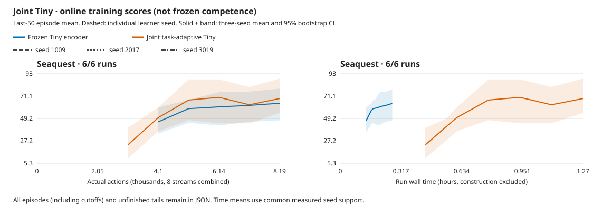

# Joint Tiny early learning screen

[All curves, episodes, tails and configurations](2026-10-03-joint-tiny-learning.json).

## Decision

Unfreezing Tiny is operational, but this short screen does **not establish a
learning or efficiency benefit**. The paired score difference is +4.604
[-15.128, 21.667]; joint training costs4.64x as much wall time. Every used Tiny
tensor updates, but held-out forecasts remain worse than persistence and show
negligible action discrimination. This is not proof that JEPA is infeasible:
only8,192 actions/1,987 updates were tested, and direct actor gradients were off.
The explicit policy-to-JEPA route is a separate qualification candidate, not a
retroactive description of these runs. No larger unchanged campaign follows
from this result.

## Recipe and accounting

Seaquest, pretrained5.49M causal Tiny, Size1M/N8/B8/T16/H15/R32, microbatch1,
replay8192, seeds1009/2017/3019. Native-detail pixels, full18 actions,
sticky.25/repeat4; no action/reward aid or intrinsic reward. Both arms re-encode
phase-zero causal chunks from pixel replay. Only encoder updates differ.
World/reward/continuation/replay-value losses train joint Tiny; the actor is
separate. The same VICReg-style stabilizer has weight.02 in both arms.
See the [declared protocol](../experiments/2026-10-02-joint-tiny.md).

All six runs start learning at action248 and finish8,192 actual actions /
1,987 updates. The independent audit reconciles chunks, resets, eviction,
training credit, completed episodes and all unfinished tails. All12 saved
checkpoints match their declared hashes/counters and contain finite tensors.
Each frozen checkpoint retains exactly148 unchanged encoder tensors; all148
change in every joint checkpoint. Final joint encoder relative-L2 movement
is1.47%/1.75%/2.88% for seeds1009/2017/3019.

Native source2980ccb, Meganeura13b19d33, Bladee349cddf, driver580.178.04.
The serial queue ran07:28–12:07 UTC on October3 (4h38m54s). All six ordinary
host guards pass: no new kernel/allocation fault, unfinished child, NVML poll
or recovery. Sampled Vulkan budget checks pass; these are not physical-free or
peak-VRAM measurements. Local evidence:
[learning queue](../../runs/joint-tiny-learning-20261003.QuYWbO/queue/result.json),
[checkpoint audit](../../runs/joint-tiny-learning-20261003.QuYWbO/checkpoint-audit.json).

## Online results

Online training scores, not frozen competence. Final scores use the last 50 completed
episodes per seed (or all if fewer); 95% intervals resample learner seeds, not episodes.

All three learner seeds complete in each arm. There are only11–13 completed
episodes per seed, so this is a particularly early/noisy comparison.

| Method | Game | Seeds | Final score [95% CI] | Human-normalized |
| --- | --- | ---: | ---: | ---: |
| frozen_tiny | Seaquest | 3 | 64.134 [47.273, 78.462] | -0.0001 |
| joint_tiny | Seaquest | 3 | 68.737 [54.545, 88.333] | 0.0000 |

Paired final-score differences (candidate minus control): resample the three learner-seed pairs,
not episodes or independent method means. Small-seed intervals remain coarse.

| Candidate − control | Game | Difference [95% CI] |
| --- | --- | ---: |
| joint_tiny − frozen_tiny | Seaquest | 4.604 [-15.128, 21.667] |

Human normalization uses [pinned upstream anchors](https://github.com/danijar/dreamerv3/blob/e3f02248693a79dc8b0ebd62c93683888ddaccfe/baselines.yaml); 1 is the reference human, not mastery.

Mean run wall time, excluding construction: **16m25s frozen versus76m08s joint**.
The final reporting windows average about.48s versus2.30s per update, including
replay, world/behavior work and cache synchronization; world training alone is
.246s versus1.947s. This is not a comparison with the cheaper historical
cached-feature control, nor a new learned-RGB comparison. GPU utilization is
unmeasured.

Online spatial-mean latent spread ends at.0146–.0148 frozen versus.0197–.0687
joint. Increased spread is not evidence of useful information. Joint latent
prediction losses also rise relative to frozen, and their raw values cannot
be compared as errors in a common fixed representation. Policy entropy stays
near uniform in both arms (about2.889 versus ln18=2.890).

## Frozen prior forecasts

[Forecast controls, event counts and provenance](2026-10-03-joint-tiny-forecasts.json).
After training, each final checkpoint observes the **same held-out trajectory**:
seed8781,1,024 forced-random actions, native pixels/sticky.25, no weight updates.
Action/reward/terminal traces agree exactly across all six checkpoints. These
6,144 additional diagnostic interactions are separate from training.
Every prior is issued before its real target; posterior statistics are not
forecasts. One-step targets cover every action; horizons2–15 have62–64 targets.

| Learner seed | Frozen prior/persistence MSE, h1 / h15 | Joint prior/persistence MSE, h1 / h15 |
| --- | ---: | ---: |
| 1009 | 17.56 / 2.59 | 98.20 / 12.20 |
| 2017 | 8.34 / 1.22 | 35.57 / 2.41 |
| 3019 | 15.52 / 2.28 | 82.47 / 6.75 |

Lower is better; **none beats persistence**, even in its own latent scale.
Actual-action versus unrelated-action MSE ratios stay very close to1.0.
Held-out mean coordinate standard deviation is.0534 for all frozen encoders
and.0713/.0794/.1072 for joint encoders. Thus the features are not globally
constant on this trajectory, but policy-relevant details may still be absent.

The trajectory has only **four positive rewards and two terminals**. One-step
reward MAE is.169–.185 frozen and.167–.195 joint, versus.078125 for always zero.
Event predictions are near the non-event baseline; these few events do not
support strong ranking/calibration claims. The probes establish weak forecasts
at this budget, not asymptotic impossibility or competence.
All six probe guards pass and record zero learner updates.
Probe sourcec278ba5 uses the unchanged learning binary; no direct-policy model
is included. Local [probe queue](../../runs/joint-tiny-forecasts-20261003.LafVpL/queue/result.json)
finished17:09 UTC without faults or recovery.

## Limits

- online last-50 completed episode means, not frozen competence.
- every episode and unfinished tail is retained; cutoffs are not silently removed.
- equal learner-seed weighting, 10000 percentile bootstrap samples; only three seeds.
- time starts before initial policy/encoding; construction is reported separately.
- time curves interpolate only within common measured support, never extrapolate.
- early learning/collapse screen, not a powered superiority or world-model sufficiency claim.
- joint updates Tiny through world/reward/continuation/replay-value losses, not direct actor-loss gradients.
- frozen refers only to Tiny; both arms train their world model and policy.
- both arms re-encode complete causal chunks from native-detail pixel replay.
- learner_mean contains update-window means, including sampled replay counts, not unique event counts.
- latent spread is an online batch statistic, not an independent held-out collapse test.
- historical cached-feature and learned-RGB results are not matched controls for this recipe.
- direct actor-gradient qualification and its learning effect remain unfinished.

