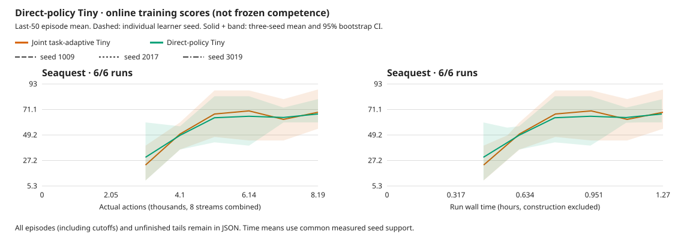

# Direct-policy Tiny early learning screen

[All curves, episodes, tails and configurations](2026-10-03-policy-tiny-learning.json).

## Decision

**The policy-to-Tiny connection works; useful latent world modeling is not
validated by this screen.** Adding initial-state actor/value gradients changes
the online score by −1.465 [−8.333, +7.273], with essentially unchanged runtime.
All three trained models still predict worse than persistence and barely
distinguish actual from unrelated actions. Keep `actor_critic_gradient` off by
default and learned RGB as the qualified 2D screening path. Do not promote this
Tiny configuration or launch a larger unchanged campaign from these results.

This is a negative **early feasibility screen**, not proof that JEPA cannot
work or that a longer run could never learn. The intervention also adds imagined
value gradients; gameplay differences do not isolate actor loss alone. The
[separate policy-only test](2026-10-03-policy-tiny-qualification.md) establishes
that policy loss itself reaches all 148 used Tiny tensors.

## Recipe and verification

Seaquest, pretrained 5.49M causal Tiny, Size1M/N8/B8/T16/H15/R32, microbatch1,
replay8192, seeds 1009/2017/3019. Native-detail pixels, full18 actions,
sticky.25/repeat4; no reward/action aid or intrinsic reward. Both arms update
Tiny from current-weight pixel replay, refresh live causal caches and use the
same world/task losses and .02 variance/covariance regularizer. The sole
intervention is `actor_critic_gradient=true`: actor/imagined-value losses reach
initial posterior states; later imagined states and targets remain detached.
[Protocol and predeclared budget](../experiments/2026-10-02-joint-tiny.md).

All three new runs complete **8,192 actions / 1,987 updates**, starting learning
at action248. Reuse the three completed task-only joint controls, not a resumed
checkpoint or repeated frozen arm. Trajectory/chunk/reset/credit audits pass.
All six new checkpoints have matching identities/counters and finite tensors;
all 148 Tiny tensors change. Final encoder relative-L2 movement is
1.342% / 1.909% / 1.835%. Compact checkpoint audits are included in the JSON above.

Native implementation c278ba5, runner/analysis 7d1cab0, Meganeura13b19d33,
Bladee349cddf, driver580.178.04. The three learning jobs run 17:36–21:25 UTC on
October3: **3h48m16s**, plus the earlier controls and qualification work. They add
24,576 training interactions / 5,961 updates; the later probes add 3,072 separate
diagnostic interactions. All six learning/probe host guards and nine-file seals
pass, with no new kernel fault, unfinished child, NVML polling or recovery.
Latest Meganeura main rechecked at21:28 remains6268ea5; no newer fix was skipped.

## Learning and cost

Online training scores, not frozen competence. Final scores use the last 50 completed
episodes per seed (or all if fewer); 95% intervals resample learner seeds, not episodes.

All three seeds complete; each run contains only 11–14 completed episodes.

| Method | Game | Seeds | Final score [95% CI] | Human-normalized |
| --- | --- | ---: | ---: | ---: |
| joint_tiny | Seaquest | 3 | 68.737 [54.545, 88.333] | 0.0000 |
| policy_tiny | Seaquest | 3 | 67.273 [60.000, 80.000] | -0.0000 |

Paired final-score differences (candidate minus control): resample the three learner-seed pairs,
not episodes or independent method means. Small-seed intervals remain coarse.

| Candidate − control | Game | Difference [95% CI] |
| --- | --- | ---: |
| policy_tiny − joint_tiny | Seaquest | -1.465 [-8.333, 7.273] |

Human normalization uses [pinned upstream anchors](https://github.com/danijar/dreamerv3/blob/e3f02248693a79dc8b0ebd62c93683888ddaccfe/baselines.yaml); 1 is the reference human, not mastery.

Per-seed task-only → direct-policy scores are **54.55→61.82, 88.33→80.00,
63.33→60.00**. The signs disagree. Mean runtime is 76m08s → 75m52s excluding
construction, a .37% difference, not a useful measured speedup. Unfreezing Tiny
still costs about 4.6× the matched frozen-encoder recipe from the
[earlier screen](2026-10-03-joint-tiny-learning.md). That frozen recipe itself
re-encodes pixel replay; it is not the cheaper historical cached-feature path.
No new RGB learning comparison is implied. GPU utilization remains unmeasured.

The final policy-loss contributions at initial states are .193/.208/.155;
imagined-value contributions are .291/.278/.240. These are nonzero losses, not
measurements of relative encoder-gradient magnitude. Policy entropy stays near
uniform (2.889 versus ln18=2.890). Nonzero gradients, weight movement and spread
do not establish policy-relevant information.

## Frozen prior forecasts

[Forecast data, controls and provenance](2026-10-03-policy-tiny-forecasts.json).
Each final checkpoint observes the same held-out random seed8781 trajectory:
1,024 actions, native pixels/sticky.25, horizon15/stride16, zero learner updates.
Its actual actions/rewards/boundaries match the corresponding earlier task-only
probe exactly. Every prediction precedes its target. Horizon1 has 1,024 targets;
horizons2–15 have 62–64. Posterior estimates are not counted as forecasts.

| Seed | Task-only prior/persistence MSE, h1 / h15 | Direct-policy prior/persistence MSE, h1 / h15 |
| --- | ---: | ---: |
| 1009 | 98.20 / 12.20 | 49.59 / 6.64 |
| 2017 | 35.57 / 2.41 | 49.55 / 4.69 |
| 3019 | 82.47 / 6.75 | 39.65 / 3.60 |

Lower is better; **every model loses to persistence**, including at the longest
tested horizon. Two seeds improve this ratio and one worsens, but encoders have
different learned coordinates/scales: this is not a shared-target MSE comparison.
Actual-action versus unrelated-action MSE ratios stay within about .001 of1.0.
The predictor has not demonstrated useful action-conditioned discrimination.

Held-out mean coordinate standard deviations are .0872/.0961/.0929: the features
are not globally constant on this trajectory. That does not rule out missing
small objects or task-relevant details. Prior reward MAE is .1803/.1953/.1618,
versus **.078125 for always zero**. Positive-event predictions are approximately
the same as non-event predictions. There are only four positive rewards and two
terminals, so ranking/calibration estimates remain weak; no broad reward-prediction
claim follows. The probes finish21:29 UTC without training or faults.

## Interpretation and next direction

The earlier failure was not only a disconnected gradient: that backend bug is
fixed and the direct policy route independently qualifies, yet this budget still
does not produce useful forecasts or a clear learning advantage. The assumption
that simply unfreezing Tiny—or adding policy gradients—would suffice is not
supported. Joint visual backward, not the small latent predictor alone, also
dominates the added compute.

Do not infer that the latent representation must lack information: a weak
predictor, moving targets, insufficient experience or objective scaling could
also explain these results. They are hypotheses, not established causes.
Before another Tiny RL campaign, a fixed-trajectory predictive-sufficiency test
should separate encoder information from predictor fit and target drift, using
held-out trajectories and event-sensitive controls. It is **not launched here**;
the active feasibility question therefore remains open, even though the declared
online comparisons are complete. The adopted roadmap retains causal Tiny as an
explicit video/3D hypothesis and learned RGB as the default 2D path. Phase3,
a new representation matrix and swarms do not start automatically.

## Limits

- online last-50 completed episode means, not frozen competence.
- every episode and unfinished tail is retained; cutoffs are not silently removed.
- equal learner-seed weighting, 10000 percentile bootstrap samples; only three seeds.
- time starts before initial policy/encoding; construction is reported separately.
- time curves interpolate only within common measured support, never extrapolate.
- early learning/collapse screen, not a powered superiority or world-model sufficiency claim.
- both arms update Tiny; policy_tiny additionally uses actor/imagined-value gradients at initial posterior states only.
- task-only controls are reused from the completed joint Tiny screen.
- both arms re-encode complete causal chunks from native-detail pixel replay.
- learner_mean contains update-window means, including sampled replay counts, not unique event counts.
- latent spread is an online batch statistic, not an independent held-out collapse test.
- historical cached-feature and learned-RGB results are not matched controls for this recipe.
- the frozen forecast comparison and decision above apply only to this early recipe, not asymptotic JEPA feasibility.

