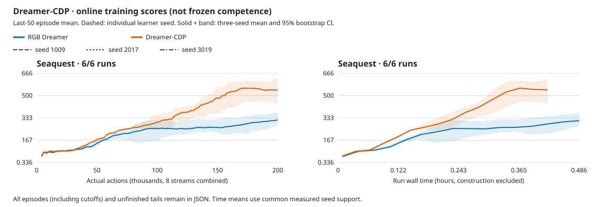

# Small Dreamer-CDP: better online learning at lower cost

October 4, 2026. [Protocol](../experiments/2026-10-04-cdp.md) ·
[Compact data, every episode and curves](2026-10-04-cdp-learning.json) ·
[Numerical qualification and retained failures](2026-10-04-cdp-qualification.md).

**All three paired Seaquest seeds favor CDP.** Its final online score is70.9%
higher, with13.6% less wall time and35.9% less world-training time. This supports
the small CDP candidate on this development screen, not Atari-wide superiority,
frozen competence or the published Crafter/XL result. All declared frozen
state/forecast diagnostics and independent audits are complete.

**Recommendation: use CDP for the next small 2D experiment, retaining RGB as
the control.** It combines Dreamer's imagined policy learning with task-adaptive
latent prediction, without an RGB decoder or a large frozen encoder. The CLI
default remains learned RGB; CDP is explicitly selected with `--cdp`. This
recommendation does not start a new campaign or establish the video/3D case.

## Learning and cost

Six fresh runs, seeds1009/2017/3019,200,000 actual actions and49,939 updates each.
Size1M/N8/B8/T16/H15/R32, full18 actions, sticky.25, repeat4, no no-ops, aids or
pretraining. Same learned RGB64 CNN/RSSM/behavior recipe; CDP replaces pixel
reconstruction with detached-target cosine prediction and the declared split
learning rates. This tests that complete package, not one isolated component.

| Method | Final online mean [seed-bootstrap 95% CI] | Mean run time | World train / full update |
| --- | ---: | ---: | ---: |
| RGB Dreamer |318.1 [278.0,379.6]|29m23s|12.787 /33.670ms|
| Dreamer-CDP |543.6 [442.4,627.2]|25m22s|8.194 /28.914ms|

Scores are the last50 completed-episode mean per learner, equally weighted
across seeds. Paired CDP-minus-RGB is **+225.5 [62.8,330.4]**. Individual RGB
scores are278.0/379.6/296.8; CDP561.2/442.4/627.2. Three-seed percentile-bootstrap
intervals are coarse; do not turn their positive lower bound into a broad
significance or mastery claim. All1,247 completed episodes and48 unfinished
stream tails remain in the JSON/raw logs. No selected seed or episode was removed.

CDP uses86.35% of paired RGB run time [85.85%,86.87%], or about1.16x throughput.
Construction adds5.35s RGB /5.30s CDP, separately from these run times. This
recipe sustains7.52–7.61x aggregate real time for RGB and8.74–8.76x for CDP;
with eight streams, that is.940–.952x and1.093–1.096x per stream respectively.
These include scheduled training and are not GPU utilization measurements. The
world objective does not remove other costs: imagined behavior still takes
about14.1ms/update, roughly half of CDP's update time. This is a changed-learning
comparison, not a pure unchanged-objective kernel speedup.

CDP has804,785 parameters versus RGB688,004. Its dense latent predictor is larger
in parameter count than this small convolutional decoder, but cheaper to train.
Both paths use one GPU RGB64 resize from native frames; neither is an
RGB64-upscaled LeVJEPA pipeline. CDP is online JEPA-style learning inside Dreamer,
not a pretrained causal-video encoder. No detached visualization decoder is kept.

## Audits and diagnostics

All six guards/seals, independent transition/counter ledgers and finite final
checkpoints pass. Zero learner debt, retries, new allocation warnings or actor
work remains in the learning queue. The automation independently reconstructs
every episode from transitions before producing the curves. Across451,266
Vulkan samples, minimum estimated headroom is9,423,355,904 bytes and maximum
estimated usage7,123,107,840 bytes. These are not physical free/peak VRAM or GPU
utilization measurements. No separate NVML polling or host recovery.

The first excluded frozen-collector smoke stopped at09:53 UTC on the exact known
allocation warning, before any diagnostic result. Its child was reaped; no new
recorded Xid/hang. Kernel source time predates journal receipt; no cause is
assigned. The broad snapshot hit its output limit, but the streaming warning
and sealed evidence remain. The remaining short qualification checks used the
user's existing two-exact-warning/120-second permission. Both pass without a
new warning:384 actions and four32-update readouts each, zero actor updates,
all250 CDP /292 RGB saved tensors unchanged, three matching real frame/transition
traces and exact h1 deterministic-prior alignment. These768 actions are excluded
diagnostic experience, not online training or competence evidence.

All six full frozen jobs pass ordinary guards and seals, without a warning
exception or new allocation warning. They collect196,608 additional diagnostic
actions: eight fixed random trajectories replayed across six models, not six
independent datasets. All1,626 saved model/optimizer tensors remain unchanged;
actor updates are zero. The24 GPU readouts each train for2,048 updates with
training-only normalization and validation-only selection. These49,152 updates
train diagnostic heads, not the actor/world model. Full probes take9m31s including
guards, with minimum sampled estimated headroom13,838,581,760 bytes.

### Readable state and causal forecasts

Held-out player-position R², averaged over three independently trained actors:

| Representation | RGB x / y | CDP x / y |
| --- | ---: | ---: |
| Current CNN | .771 / .885 | .874 / .919 |
| Current full posterior | .113 / .722 | .864 / .859 |
| One-step full prior | −.080 / .596 | .772 / .748 |
| Fifteen-step full prior | −.096 / .398 | .671 / .689 |

The largest readability gain is inside the RSSM. Readout quality does not prove
information is absent from RGB: generalization still limits the fitted heads
(CDP h15 x training R² is about.99 versus.67 held out). Posterior estimates are
not forecasts. Test encoder effective rank is24.27 for CDP versus9.17 for RGB,
with nonzero spread in every seed; rank alone is not representation quality.

CDP's15-step embedding cosine error is **.580x persistence, .615x the constant
training mean and .616x unrelated actions**. One-step prediction still loses
to persistence (1.546x). Ratios are means of per-model ratios, not ratios of
pooled errors; per-seed values and bootstrap intervals are in the JSON.

At15 steps, fitted CDP player-position RMSE is .692x/.771x unrelated actions
for x/y. Against persistence through the learned posterior readout it is
.917x/.956x: x improves in all three seeds, y in only two, with y's interval
crossing1. Both methods lose to one-step posterior persistence.
Against **privileged coordinate persistence on the same current-player-visible
origins**, CDP's15-step ratios are1.082x/1.297x: it loses on both coordinates.
This last matched-visibility comparison is post-hoc CPU analysis of saved
predictions, without refitting or test-based selection. The original raw
coordinate-persistence report excludes missing current labels; its cohort
must not be compared directly with all-origin fitted metrics.

Reward MAE still loses to predicting zero: CDP/zero is1.354x at h1 and1.647x at
h15. Some reward-ranking signal remains, but favorable action-conditioned reward
prediction is not consistent. Forecast samples contain only7 positive reward
endpoints/768 at h1 and4/749 at h15, with one terminal endpoint at each horizon.
The three complete held-out traces contain95 positive reward transitions and
21 terminals; replaying them across models does not multiply independent events.
There are no bullet labels, full-game-state sufficiency or imagined-RGB claims.

Independent audits pass tensor bytes, action/reset accounting, split/frame/trace
identity, exact h1 causal alignment, training-only normalization, validation
selection and recomputation of saved readout/forecast metrics. All learning,
probe and audit services have exited successfully; no GPU work remains active.

## Reproducibility and limits

Production implementation `bee4e64`, native library
`32353ffb5d4516aa9281e94004f7b7ca2f126c9d29bfd62e33c36f78c44f502a`,
Meganeura13b19d33/Bladee349cddf, RTX5080/580.178.04. Numerical qualification includes
independent F64 cosine derivatives and1,300 CDP /1,524 upstream RGB comparisons;
gradient isolation/common-gradient optimizer parity is not bitwise stochastic
trajectory equivalence. Historical Phase2 RGB/Tiny runs are not reused controls
for this changed backend. The authors' Crafter/XL result and unmeasured speed
claims are not reproduced by this small Seaquest experiment.

The10:21 UTC upstream recheck finds Meganeura main6268ea5 and Blade maine349cddf
unchanged. Local validation passes111 Rust CPU and1,090 Python tests, plus
workspace/binding Clippy for the unchanged native implementation. CI282 passes
on all platforms at `448a10b`; the PR dashboard tracks final-head CI. No native
rebuild was needed for the final analysis/report.

The evidence supports the broad bet on cheaper useful latent prediction, not
an isolated causal claim about cosine loss versus the split learning rates.
The next research step is a separately declared exploration/reward mechanism
against extrinsic-only CDP. Video/3D priors remain a separate hypothesis; no
new representation matrix, asynchronous learner or swarm is launched here.

Raw local evidence: [experiment directory](../../runs/cdp-evaluation-20261004.olfQrV),
[complete independently audited summary](../../runs/cdp-evaluation-20261004.olfQrV/complete-audited-summary.json),
[six successful guards](../../runs/cdp-evaluation-20261004.olfQrV/learning-queue/result.json).
Those workspace artifacts are not public downloads. The compact JSON and SVG
above are committed. No new learning campaign, Phase3 or swarms start here.
