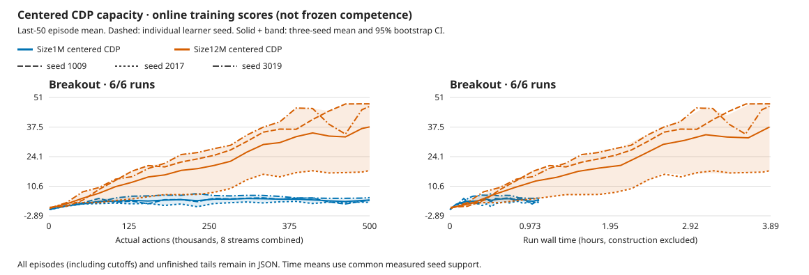

# Larger CDP capacity improves Breakout in all three seeds

**Size12M reaches frozen mean 38.21 versus Size1M's 5.14 at the same 500k-action
budget.** Every paired seed improves, but training takes 3.58× as long and the
unchanged long-run reference is 381.81. This is useful capacity evidence, not
Breakout mastery, Atari-wide superiority or completion of the five-game goal.

The [declared study](../experiments/2026-10-07-cdp-capacity.md) finishes October 7
at **15:39:48 UTC**, after 11h42m14s. The post-completion CPU review passes in
15.38s without additional GPU work or gameplay. [Compact data](2026-10-07-cdp-capacity.json),
[full review](../../runs/cdp-12m-breakout-20261007.3msA0ITD/capacity-review.json),
[review script](../../runs/cdp-12m-breakout-20261007.3msA0ITD/review.py).

## Scores and cost

Frozen scores use the first three natural episodes in each of eight streams,
sampled policy, with zero learning. Bootstrap intervals resample the three
independent learner seeds, not the 72 episodes. With three seeds they are coarse.

| Seed | Retained 1M frozen | 12M frozen | Actual 12M initial | 12M online last-50 |
| --- | ---: | ---: | ---: | ---: |
| 1009 | 4.00 | 48.17 | 1.42 | 48.08 |
| 2017 | 3.50 | 15.88 | 1.63 | 17.74 |
| 3019 | 7.92 | 50.58 | 1.63 | 46.94 |
| Mean | 5.14 | 38.21 | 1.56 | 37.59 |

Paired frozen gain: **+33.07 [12.38, 44.17]**. The 12M frozen mean interval is
[15.88, 50.58]. Seed2017 remains substantially weaker; no seed or episode is
discarded. No selected episode reaches the historical two-wall/864-point gate.
The different published protocol and long-run averaging window prevent exact
benchmark parity claims; the [released reference](2026-10-05-dreamerv3-five-game-reference.json)
and all five original targets remain unchanged.

Three fresh learners add **1.5M actions, 5,995,936 emulator frames, 374,817
updates and 11h39m37s training**. Each learner executes 500k actions/124,939
updates, approximately 2M frames, not the reference's 200M frames. The retained
1M controls cost 3h15m35s training in total. Frozen collection adds 88,120
actions. Earlier learning, diagnostics and the 12M preflight remain additional
cost; no checkpoint lifetime resume or video pretraining is used.

Dashed curves retain all six learners. Solid curves and bands show equal-seed
means and 95% bootstrap intervals. The plot uses every 50th common measured
action point plus the final point, and all 16 common-time points. Full grids,
all episodes and unfinished tails remain in the raw reports. These are online
last-50 means, not frozen evaluation. No extrapolation extends the shorter 1M
runs; their performance after equivalent additional compute is unknown.

## What changed, and what passed

Only the model preset changes. Size12M expands CNN depth 4→16, embedding
256→1024, deterministic RSSM state 512→2048, categorical classes 4→16 across
32 groups, and hidden widths 64→256. Actual trainable parameters including
CDP/exploration total **16,334,353**. Encoder, recurrent, policy and exploration
capacity change together; this does not isolate which component was limiting.

Same centered CDP, action-effects coefficient1, N8/B8/T16/H15/R32, microbatch8,
replay100000, cosine500, encoder6e-6/dynamics4e-4/base4e-5, warmup1000, AGC.3
and ac_grads=false. Same full18/sticky.25/repeat4, no reset no-ops, native image
input with one GPU RGB64 resize. No action hint, externally shaped reward,
detector, privileged state or new loss enters the actor. Qualified native
`6d38eea2`, Meganeura `c6376542`, Blade `e349cddf`; no mid-study rebuild.

All nine guarded jobs pass. All 144 selected final/initial frozen episodes are
natural, with zero cutoffs/updates and exact 346 saved tensors per model.
All six whole action/reward/reset/frame replays and stream-zero videos pass;
18 excess episodes and every unfinished tail remain. Final finite checkpoints,
exact actual-initial identities, counters and zero training debt are checked.
Three known standalone allocation warnings are retained; no API/numerical/hard
fault is recorded, and no NVML polling or recovery occurs. Estimated Vulkan headroom checks pass;
they are not physical-free or peak-VRAM measurements.

The review rechecks the saved audits, independently selects each stream's first
three natural episodes, recomputes scores and paired summaries, verifies video
frame counts/rates, and checks every declared source pin. The original
controller, its audits and the first aggregate-only visualization remain intact.

Development evaluation seeds are reused from the retained 1M controls:
base4,000,000,000+learner seed, with the same stream offsets and 600k-action cap.
They are not an untouched test suite. The [1M reconciliation](2026-10-07-cdp-centered-five-game-budget.md#evaluation-repair-and-retained-failures)
retains the original3019 cutoff, corrected cohort and its 8→1 host-worker
difference. That exception does not become an unchanged-runtime timing claim.

## Decision

Use the existing 12M preset as the next Atari quality candidate; keep 1M as a
fast engineering control. The larger preset improves all three Breakout seeds
without another representation redesign. It has not yet been tested on the
other four games in this recipe, nor had its prior forecasts separately probed.
Do not transfer the earlier small-model diagnostic conclusions to these models.

Before committing a larger learning budget, qualify the
[deferred exploration projection reuse](../experiments/2026-10-07-cdp-capacity.md#deferred-compute-candidate-reuse-the-exploration-state-projection)
and review the latest backend in a bounded performance comparison. Whole updates
average **110.03ms: 55.4% imagination, 29.9% world training, 9.2% posterior**.
Observed playing/training is about 2.38× aggregate /0.30× per-stream realtime;
GPU utilization remains unmeasured. Target measured whole-agent cost, preserving
the learning recipe and testing both timing arms on the same backend.

The controller is stopped successfully; no worker or automatic extension
remains. All five DreamerV3 quality targets and the budget question stay open.

## Whole rollout videos

Full stream-zero videos, including excess episodes and unfinished tails.
Scores above cover all eight streams. These links require the local workspace;
the videos are not hosted on GitHub.

| Seed | Trained | Actual initial |
| --- | --- | --- |
| 1009 | [whole rollout](../../runs/cdp-12m-breakout-20261007.3msA0ITD/breakout-centered-1009-candidate-frozen.mp4) | [whole control](../../runs/cdp-12m-breakout-20261007.3msA0ITD/breakout-centered-1009-untrained-frozen.mp4) |
| 2017 | [whole rollout](../../runs/cdp-12m-breakout-20261007.3msA0ITD/breakout-centered-2017-candidate-frozen.mp4) | [whole control](../../runs/cdp-12m-breakout-20261007.3msA0ITD/breakout-centered-2017-untrained-frozen.mp4) |
| 3019 | [whole rollout](../../runs/cdp-12m-breakout-20261007.3msA0ITD/breakout-centered-3019-candidate-frozen.mp4) | [whole control](../../runs/cdp-12m-breakout-20261007.3msA0ITD/breakout-centered-3019-untrained-frozen.mp4) |
