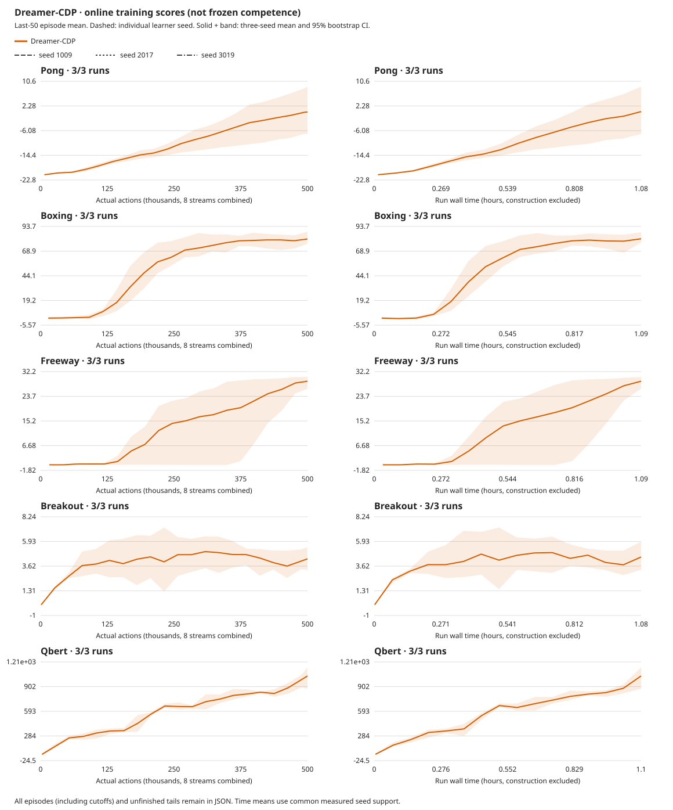

# Centered CDP: five games at500k actions per learner

**All fifteen learners improve over their actual initial controls. None reaches
the unchanged long-run DreamerV3 reference.** Boxing and Freeway pass their
historical mastery gates in every seed; Pong remains seed-sensitive, while
Breakout and Qbert remain weak. Completing this allocation does not finish the
five-game quality or budget goal.

The [declared study](../experiments/2026-10-06-cdp-centered-five-game-budget.md)
finishes October7 at02:30:07 UTC, after16h45m23s. Final acceptance follows the
evaluation repair below. [Compact data](2026-10-07-cdp-centered-five-game-budget.json),
[online curves](2026-10-07-cdp-centered-five-game-budget.svg) and
[full reconciled audit](../../runs/cdp-natural-cohort-20261007.wa2cc3ZS/independent-report.json).

## Frozen results

Each score is the first3 natural episodes in each of8 streams, sampled policy,
zero learning. Intervals bootstrap the **three learner seeds**, not72 independent
episodes. Published last10% long-run means use all released seeds; different
protocols/models/averaging windows prevent an exact parity claim.

| Game | Seeds1009 /2017 /3019 | Frozen mean [95% CI] | Actual initial mean | Published long-run reference |
| --- | ---: | ---: | ---: | ---: |
| Boxing | 74.46 / 71.63 / 87.00 | 77.69 [71.63, 87.00] | 1.00 | 99.61 |
| Pong | 2.92 / 11.92 / -1.21 | 4.54 [-1.21, 11.92] | -20.40 | 20.45 |
| Freeway | 29.50 / 30.54 / 30.75 | 30.26 [29.50, 30.75] | 0.00 | 33.40 |
| Breakout | 4.00 / 3.50 / 7.92 | 5.14 [3.50, 7.92] | 1.57 | 381.81 |
| Qbert | 1057.29 / 892.71 / 1031.25 | 993.75 [892.71, 1057.29] | 191.32 | 193220.77 |

- Boxing:72/72 wins; Freeway:72/72 rounds with27–32 crossings. Both clear
  their unchanged historical gates in all three seeds, not their quality targets.
- Pong:19/24,24/24,11/24 wins. All seeds learn, but3019 still loses a majority
  and no seed reaches the original mean+15 mastery gate.
- Breakout:all three remain weak. A saved-action replay of1009 finds the paddle
  at its right boundary for at least half the frames; this is poor control,
  not proof of feature collapse. The repaired3019 evaluation retains a timeout.
- Qbert:only2/72 selected episodes finish the first pyramid. More cube rewards
  are not reliable level completion.

Online last-50 means are Boxing81.09, Pong+0.25, Freeway28.89, Breakout4.30 and
Qbert1,035.00. Near2M frames, published Atari57 means are89.82,−7.16,2.13,12.73
and2,665.04 respectively. Thus current early learning is ahead descriptively on
Pong/Freeway and behind on the others, especially Breakout/Qbert. These are
different windows/protocols, not a matched RGB control or a compute-saving proof.
The [released reference](2026-10-05-dreamerv3-five-game-reference.json) and
original long-run targets remain unchanged.

Plots show every50th measured common action point plus the final point, and
all16 common-time points, with seed-bootstrap bands. Full action grids, all
episodes and unfinished tails remain in the raw report; no favorable bins or
seeds were selected.

## Cost, recipe and checks

Fifteen fresh learners each use500,000 actions/124,939 updates: **7.5M actions,
29,983,882 executed frames,1,874,085 updates and16h24m7s training**, excluding
construction/evaluation. This is approximately2M frames per learner, not the
200M-frame reference budget. Earlier studies, qualification and diagnosis remain
additional cost, not hidden inside this allocation.

Same centered CDP Size1M/N8/B8/T16/H15/R32, replay100000, full-batch BPTT,
cosine500, encoder6e-6/dynamics4e-4/base4e-5, warmup1000, AGC.3, ac_grads=false,
action-effects coefficient1. Full18/sticky.25/repeat4, no reset no-ops, native
observations with one GPU RGB64 resize. No action hints, external reward shaping,
video pretraining or checkpoint lifetime resume. Qualified native6d38eea2,
Meganeurac6376542/Bladee349cddf; no mid-study native rebuild.

Mean updates29.70ms spend46.3% in imagination and29.4% in world training.
Measured training throughput is127.0 aggregate actions/s,8.46× aggregate /
1.06× per-stream realtime. Eight streams share batched acting and one learner.
**GPU utilization is unmeasured.** These are current production timings, not a
matched whole-agent speedup against the old backend or RGB.

After repair, all720 selected natural episodes, exact346 saved tensors/model,
zero evaluation updates, full replay/video checks and46 GPU guards pass.
The accepted evaluations retain262 excess completed episodes and every tail,
including one timeout outside the natural cohort. The superseded evaluation and
its video remain separate. All31 whole videos are retained, not just successes.
Seven known standalone allocation warnings occur in original jobs; no API,
numerical or hard GPU fault occurs. The separate CPU audit failures below remain
recorded; this is not a claim of a failure-free workflow.

## Evaluation repair and retained failures

The independent audit caught an implementation/declaration mismatch:
Breakout3019's original first24 completed episodes included23 natural episodes
and one100,000-frame timeout (stream6, episode2). Its8.0833 score and original
three-seed5.1944 summary are **not accepted natural-cohort results**.

New vector v5 counts natural episodes separately from total boundaries/resets;
cohort selection excludes but retains cutoffs. Historical v4 artifacts keep
their completed-episode semantics and exact accounting schema. Commitsdefc69d
and9a4285e pass1,185 Python tests. Native inference/training is unchanged.

One corrected frozen rerun uses the same final checkpoint, held-out seeds and
600k-action/30min caps. It reproduces all207,288 original actions, rewards,
episode boundaries and resets exactly, then stops at209,504 actions with the
third natural episode for stream6. Final score7.9167; the initial control stays
unchanged. The original263 completed episodes, video and failed audit remain.

The rerun's strict identity check also stopped: its service CPU quota changed
native host workers8→1. A scoped CPU-only review retained that failure, checked
the exact prefix and all frozen tensors, and accepted the score with this
runtime difference disclosed. No unchanged-runtime timing claim or GPU retry.
The final reporter then caught an added v4 accounting field;9a4285e preserves
the original replay receipt schema without editing old evidence. Its failed
report log and pre-fix auditor snapshots remain retained.

Accepted frozen evaluations total1,243,536 actions; the superseded207,288
actions bring **all frozen collection to1,450,824 actions**. The correction
adds209,504 actions, including the repeated207,288-action prefix. This is extra
evaluation compute, not uninterrupted actor resume or new learning experience.

Repair artifacts:
[review](../../runs/cdp-natural-cohort-20261007.wa2cc3ZS/result.json),
[replay](../../runs/cdp-natural-cohort-20261007.wa2cc3ZS/replay.json),
[superseded whole video](../../runs/cdp-centered-five-20261006.ODmbym7M/breakout-centered-3019-candidate-frozen.mp4).
Original root:`runs/cdp-centered-five-20261006.ODmbym7M`.
Reconciliation root:`runs/cdp-natural-cohort-20261007.wa2cc3ZS`.

## Next decision

The [frozen Breakout diagnosis](2026-10-07-cdp-breakout-world.md) now completes
across all three initial/final pairs. Ball forecasts are weak, but its pixel
control is ill-conditioned. Next, one shared GPU readout with fixed RGB scaling
on saved pixels, no new actions or actor updates, before a capacity/loss decision
or more training. Keep the other four quality targets open.

This is a longer centered-package study, **not** a fresh five-game raw/centered/
RGB ablation. The controlled centering evidence remains
[the earlier Pong comparison](2026-10-06-cdp-centered-learning.md) and
[paired world probes](2026-10-06-cdp-centered-world.md).
[Earlier200k results](2026-10-05-cdp-five-game-screen.md) and
[failed raw500k Pong](2026-10-06-cdp-pong-budget.md) remain evidence and extra cost.
No automatic training extension.

## Whole rollout videos

Whole stream-zero recordings, including excess episodes and unfinished tails.
Scores above cover all eight streams. These local links require the workspace;
they are not GitHub-hosted video downloads. Breakout3019 links the repaired run.

| Game | Seed1009 | Seed2017 | Seed3019 |
| --- | --- | --- | --- |
| Boxing | [final](../../runs/cdp-centered-five-20261006.ODmbym7M/boxing-centered-1009-candidate-frozen.mp4) / [initial](../../runs/cdp-centered-five-20261006.ODmbym7M/boxing-centered-1009-untrained-frozen.mp4) | [final](../../runs/cdp-centered-five-20261006.ODmbym7M/boxing-centered-2017-candidate-frozen.mp4) / [initial](../../runs/cdp-centered-five-20261006.ODmbym7M/boxing-centered-2017-untrained-frozen.mp4) | [final](../../runs/cdp-centered-five-20261006.ODmbym7M/boxing-centered-3019-candidate-frozen.mp4) / [initial](../../runs/cdp-centered-five-20261006.ODmbym7M/boxing-centered-3019-untrained-frozen.mp4) |
| Pong | [final](../../runs/cdp-centered-five-20261006.ODmbym7M/pong-centered-1009-candidate-frozen.mp4) / [initial](../../runs/cdp-centered-five-20261006.ODmbym7M/pong-centered-1009-untrained-frozen.mp4) | [final](../../runs/cdp-centered-five-20261006.ODmbym7M/pong-centered-2017-candidate-frozen.mp4) / [initial](../../runs/cdp-centered-five-20261006.ODmbym7M/pong-centered-2017-untrained-frozen.mp4) | [final](../../runs/cdp-centered-five-20261006.ODmbym7M/pong-centered-3019-candidate-frozen.mp4) / [initial](../../runs/cdp-centered-five-20261006.ODmbym7M/pong-centered-3019-untrained-frozen.mp4) |
| Freeway | [final](../../runs/cdp-centered-five-20261006.ODmbym7M/freeway-centered-1009-candidate-frozen.mp4) / [initial](../../runs/cdp-centered-five-20261006.ODmbym7M/freeway-centered-1009-untrained-frozen.mp4) | [final](../../runs/cdp-centered-five-20261006.ODmbym7M/freeway-centered-2017-candidate-frozen.mp4) / [initial](../../runs/cdp-centered-five-20261006.ODmbym7M/freeway-centered-2017-untrained-frozen.mp4) | [final](../../runs/cdp-centered-five-20261006.ODmbym7M/freeway-centered-3019-candidate-frozen.mp4) / [initial](../../runs/cdp-centered-five-20261006.ODmbym7M/freeway-centered-3019-untrained-frozen.mp4) |
| Breakout | [final](../../runs/cdp-centered-five-20261006.ODmbym7M/breakout-centered-1009-candidate-frozen.mp4) / [initial](../../runs/cdp-centered-five-20261006.ODmbym7M/breakout-centered-1009-untrained-frozen.mp4) | [final](../../runs/cdp-centered-five-20261006.ODmbym7M/breakout-centered-2017-candidate-frozen.mp4) / [initial](../../runs/cdp-centered-five-20261006.ODmbym7M/breakout-centered-2017-untrained-frozen.mp4) | [final](../../runs/cdp-natural-cohort-20261007.wa2cc3ZS/breakout-centered-3019-candidate-frozen-natural.mp4) / [initial](../../runs/cdp-centered-five-20261006.ODmbym7M/breakout-centered-3019-untrained-frozen.mp4) |
| Qbert | [final](../../runs/cdp-centered-five-20261006.ODmbym7M/qbert-centered-1009-candidate-frozen.mp4) / [initial](../../runs/cdp-centered-five-20261006.ODmbym7M/qbert-centered-1009-untrained-frozen.mp4) | [final](../../runs/cdp-centered-five-20261006.ODmbym7M/qbert-centered-2017-candidate-frozen.mp4) / [initial](../../runs/cdp-centered-five-20261006.ODmbym7M/qbert-centered-2017-untrained-frozen.mp4) | [final](../../runs/cdp-centered-five-20261006.ODmbym7M/qbert-centered-3019-candidate-frozen.mp4) / [initial](../../runs/cdp-centered-five-20261006.ODmbym7M/qbert-centered-3019-untrained-frozen.mp4) |
