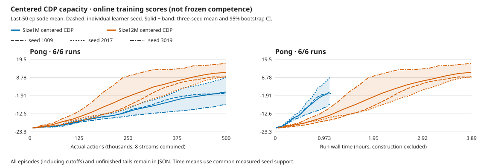

# Larger CDP capacity improves all three Pong seeds

**Size12M reaches frozen mean +12.40 versus Size1M's +4.54 at the same
500k-action budget, with 69/72 wins.** All three seeds improve over their actual
initial and retained small-model controls. Training costs 3.57× as much wall
time. Only seed3019 passes the unchanged historical mastery gate; the 20.45
long-run reference and the full five-game goal remain unmet.

The [declared four-game allocation](../experiments/2026-10-07-cdp-12m-four-game-capacity.md)
completes its Pong cohort October8 at **04:52 UTC** and continues to Qbert,
Boxing and Freeway. This is not completion of that allocation.
The independent CPU review passes in15.21s with no additional GPU work or game
actions. [Compact data](2026-10-08-cdp-pong-capacity.json),
[full review](../../runs/cdp-12m-four-20261007.iEvfk9Vm/pong-capacity-review.json),
[review script](../../runs/cdp-12m-four-20261007.iEvfk9Vm/review_game.py).

## Scores and cost

Frozen scores use the first three natural episodes per stream, eight streams,
sampled policy and zero learning. Intervals resample the three learner seeds,
not episodes; with three seeds they are coarse.

| Seed | Retained1M frozen |12M frozen | Actual12M initial |12M wins |12M online last50 |
| --- | ---: | ---: | ---: | ---: | ---: |
|1009 |+2.92 |+7.21 |−20.13 |21/24 |+9.14 |
|2017 |+11.92 |+12.96 |−20.25 |24/24 |+9.40 |
|3019 |−1.21 |+17.04 |−20.25 |24/24 |+17.18 |
| Mean / total |+4.54 |+12.40 |−20.21 |69/72 |+11.91 |

Paired frozen gain: **+7.86 [1.04,18.25]**. The12M mean interval is
[7.21,17.04]. The weakest retained seed3019 improves most, but seed1009 still
loses three selected games and2017 remains below the historical mean≥15 gate.
Do not equate aggregate95.8% wins with mastery in every learner seed.

Three fresh learners add **1.5M actions,5,999,250 emulator frames,374,817 updates
and11h40m7s training**. Each learner uses500k actions/124,939 updates. Retained1M
controls cost3h15m59s in total. Frozen collection adds359,456 actions.
Earlier training, qualification, diagnostics and reporting failures remain
additional development cost. No checkpoint lifetime resume or video prior.

Dashed curves show all six learner traces; solid curves and bands show
equal-seed means and95% bootstrap intervals. The plot keeps every50th common
measured action point plus the last, and every common-time point. Full grids,
episodes and tails remain in raw reports. These are online last50 means, not
frozen scores. The shorter1M runs are not extrapolated to12M's additional wall
time; performance at equal compute remains unknown.

## What changed, and what passed

The whole model preset grows from1M to12M: CNN, embedding, RSSM, policy and
exploration ensemble together, totaling16,334,353 actual trainable parameters.
The learning configuration differs only in model size. The qualified runtime
also changes from retained native6d38eea2/Meganeurac6376542 to native83be73bf/
Meganeuraf104f354, with Bladee349cddf unchanged. This is **not an exact same-binary
capacity ablation**. The [backend qualification](2026-10-07-meganeura-control-refresh.md)
does not prove universal trajectory parity. No mid-allocation rebuild.

Same centered CDP/action-effects coefficient1, N8/B8/T16/H15/R32,
microbatch8/replay100000, cosine500, encoder6e-6/dynamics4e-4/base4e-5,
warmup1000, AGC.3, ac_grads=false; full18/sticky.25/repeat4/no reset no-ops.
Native pixels receive one GPU RGB64 resize. No RAM, detector, action hint,
external shaping or new encoder/loss enters the actor.

All **nine guards,144 selected natural frozen episodes, exact346 tensors/model
and six whole replay/video checks pass**. Zero selected cutoffs or frozen
updates; eight excess episodes and all unfinished tails remain. Final finite
checkpoints, actual-initial identities, all124,939 updates/seed and zero
training debt pass. Eight standalone allocation warnings are retained; no
recorded API/numerical/hard fault or recovery. No separate NVML polling.

Independent review rereads training and frozen records, verifies source pins,
reselects each stream's first three natural episodes, checks tensor equality
and video hashes/frame counts/rates, and recomputes aggregates and curves.
The first supplemental CPU reporter used `frozen` instead of `candidate`
for the retained-control JSON key. The original failed source/error remain
in the raw directory; correcting that lookup changed no model, cohort,
training, game action or runtime.

Evaluation reuses development seeds from the retained1M controls:
base4,000,000,000+learner seed and the same stream offsets. This is not an
untouched final test. Our500k actions are approximately2M frames versus the
[reference's200M frames](2026-10-05-dreamerv3-five-game-reference.json).
Published online windows/protocols differ from these frozen cohorts;
no exact benchmark parity or matched RGB compute-saving claim.

## Decision

Together with [Breakout](2026-10-07-cdp-capacity.md), this supports12M as the
quality candidate while retaining1M as the faster engineering control. It does
not isolate encoder versus RSSM capacity or establish12M prior-forecast quality.

Continue only the already declared Qbert/Boxing/Freeway cohorts, with unchanged
budgets and audits. No Pong extension or representation/optimization sweep.
Mean update time is110.24ms:55.4% imagination,29.8% world training and9.2%
posterior. GPU utilization is still unmeasured; this is a capacity/cost tradeoff,
not an unchanged-learning throughput improvement. All five long-run quality
targets and the budget question stay open.

## Whole rollout videos

Whole stream-zero videos include excess episodes and unfinished tails; scores
above cover all eight streams. Links require the local workspace, not GitHub
downloads.

| Seed | Trained | Actual initial |
| --- | --- | --- |
|1009 | [whole rollout](../../runs/cdp-12m-four-20261007.iEvfk9Vm/pong-centered-1009-candidate-frozen.mp4) | [whole control](../../runs/cdp-12m-four-20261007.iEvfk9Vm/pong-centered-1009-untrained-frozen.mp4) |
|2017 | [whole rollout](../../runs/cdp-12m-four-20261007.iEvfk9Vm/pong-centered-2017-candidate-frozen.mp4) | [whole control](../../runs/cdp-12m-four-20261007.iEvfk9Vm/pong-centered-2017-untrained-frozen.mp4) |
|3019 | [whole rollout](../../runs/cdp-12m-four-20261007.iEvfk9Vm/pong-centered-3019-candidate-frozen.mp4) | [whole control](../../runs/cdp-12m-four-20261007.iEvfk9Vm/pong-centered-3019-untrained-frozen.mp4) |
