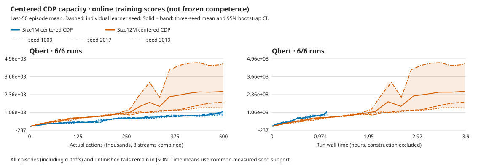

# Larger CDP improves Qbert rewards, but only one seed clears the first pyramid

**Size12M reaches frozen mean2,657.99 versus Size1M's993.75 at500k actions per
learner.** Every paired seed improves its score. First-pyramid completion rises
from2/72 to24/72 episodes, entirely from seed3019; the other two12M seeds
complete none. Training costs3.51× as much wall time. No seed meets the historical
mastery gate or the193,220.77 long-run reference. The five-game goal stays open.

Qbert's part of the [declared four-game allocation](../experiments/2026-10-07-cdp-12m-four-game-capacity.md)
finishes October8 at **16:34 UTC**. Independent CPU review passes in15.09s, with
zero new GPU work or game actions. Boxing and Freeway continue unchanged;
finishing Qbert is not finishing this allocation.
[Compact data](2026-10-08-cdp-qbert-capacity.json),
[full review](../../runs/cdp-12m-four-20261007.iEvfk9Vm/qbert-capacity-review.json),
[review script](../../runs/cdp-12m-four-20261007.iEvfk9Vm/review_game.py).

## Scores, milestones and cost

Frozen cohorts are each stream's first three natural episodes, eight streams,
sampled policy and zero learning. Confidence intervals resample the three
learner seeds, not episodes; three-seed intervals are coarse.

| Seed | Retained1M frozen |12M frozen | Actual12M initial | First pyramids1M→12M |12M online last50 |
| --- | ---: | ---: | ---: | --- | ---: |
|1009 |1,057.29 |1,790.63 |175.00 |2/24→0/24 |1,809.00 |
|2017 |892.71 |1,328.13 |273.96 |0/24→0/24 |1,383.50 |
|3019 |1,031.25 |4,855.21 |153.13 |0/24→24/24 |4,608.50 |
| Mean / total |993.75 |2,657.99 |200.69 |2/72→24/72 |2,600.33 |

Paired score gain: **+1,664.24 [435.42,3,823.96]**. The12M mean interval is
[1,328.13,4,855.21]. Seed1009 gains score but loses its two selected pyramid
completions; larger capacity does not improve every metric in every seed.
Only3019 completes the first pyramid reliably in this cohort, and its4,855.21
mean is still below the historical15,000-score threshold. All three initial
controls complete zero pyramids.

Milestones are joined from the full CPU replay to the exact selected natural
episodes. A positive score is not a win or pyramid completion. The supplemental
reviewer now names that count `positive_return_episodes` and reports task
success separately; the earlier Pong-specific reviewer source is preserved
unchanged. No acting policy sees the diagnostic observer.

Three fresh learners add **1.5M actions,5,996,850 emulator frames,374,817 updates
and11h39m35s training**. Retained1M training costs3h19m34s in total.
Frozen evaluation adds114,408 actions. Every learner uses500k actions/124,939
updates, approximately2M frames, not the reference's200M frames. Previous
training, diagnostics, qualification and interrupted work remain additional
cost. No video prior or checkpoint lifetime resume is used.

Dashed lines retain all six learners. Solid means and95% bands use equal learner
weight. The plot retains every50th common measured action point plus the last,
and every common-time point. Full grids, all episodes and unfinished tails remain
in raw reports; per-episode task outcomes are omitted only from the compact JSON.
These are online last50 scores, not frozen evaluation. No extrapolation extends
the shorter1M curves: equal-compute performance remains unknown.

## What changed, and what passed

The whole model preset changes1M→12M, growing the CNN, embedding, RSSM, policy
and exploration ensemble together; actual trainable count16,334,353. Learning
configuration otherwise matches. Runtime also changes from retained native
6d38eea2/Meganeurac6376542 to83be73bf/f104f354, Bladee349cddf unchanged.
The [qualified refresh](2026-10-07-meganeura-control-refresh.md) is not proof
of universal trajectory parity; this is not an exact same-binary capacity
ablation or an isolated encoder test. No mid-allocation rebuild.

Same centered CDP/action-effects coefficient1, N8/B8/T16/H15/R32,
microbatch8/replay100000, cosine500, encoder6e-6/dynamics4e-4/base4e-5,
warmup1000, AGC.3 and ac_grads=false. Full18/sticky.25/repeat4/no reset no-ops;
native pixels receive one GPU RGB64 resize. No new loss, action hint, detector,
RAM input or externally shaped reward enters the actor.

All **nine guards,144 selected natural frozen episodes, exact346 tensors/model
and six whole replay/video checks pass**. Zero selected cutoffs or frozen
updates. Both excess episodes and every unfinished tail remain. Source pins,
finite checkpoints, actual initial identities, all124,939 updates/seed and zero
training debt pass. Seventeen standalone allocation warnings are retained;
no recorded API/numerical/hard fault, separate NVML polling or recovery.

The review rereads training/frozen records, independently reselects natural
cohorts, verifies tensor equality and video hashes/frame counts/rates, and
recomputes summaries and curves. Development evaluation seeds are reused from
the retained controls, base4,000,000,000+learner seed; this is not an untouched
test. The [reference](2026-10-05-dreamerv3-five-game-reference.json) retains
its original long-run window and every released seed. Different online/frozen
protocols and budgets prevent exact parity or matched RGB compute-saving claims.

## Decision

Capacity now improves frozen reward in every paired seed on three games:
[Breakout](2026-10-07-cdp-capacity.md), [Pong](2026-10-08-cdp-pong-capacity.md)
and Qbert. It is not sufficient for reliable Qbert competence. A successful
first-pyramid learner exists, but two others still fail that milestone; this
does not identify whether representation, exploration, credit assignment or
training duration is limiting them.

Finish the already declared Boxing/Freeway cohorts before choosing another
learning allocation. No larger model, Qbert budget extension or representation
sweep is triggered by this result.12M prior-forecast quality remains untested.
Mean updates110.03ms spend55.4% in imagination,29.8% world training and9.2%
posterior. GPU utilization remains unmeasured. All five long-run quality targets
and the budget question remain open.

## Whole rollout videos

Whole stream-zero videos include excess episodes and unfinished tails. Scores
and milestone counts above cover all eight streams. These links require the
local workspace; videos are not hosted on GitHub.

| Seed | Trained | Actual initial |
| --- | --- | --- |
|1009 | [whole rollout](../../runs/cdp-12m-four-20261007.iEvfk9Vm/qbert-centered-1009-candidate-frozen.mp4) | [whole control](../../runs/cdp-12m-four-20261007.iEvfk9Vm/qbert-centered-1009-untrained-frozen.mp4) |
|2017 | [whole rollout](../../runs/cdp-12m-four-20261007.iEvfk9Vm/qbert-centered-2017-candidate-frozen.mp4) | [whole control](../../runs/cdp-12m-four-20261007.iEvfk9Vm/qbert-centered-2017-untrained-frozen.mp4) |
|3019 | [whole rollout](../../runs/cdp-12m-four-20261007.iEvfk9Vm/qbert-centered-3019-candidate-frozen.mp4) | [whole control](../../runs/cdp-12m-four-20261007.iEvfk9Vm/qbert-centered-3019-untrained-frozen.mp4) |
