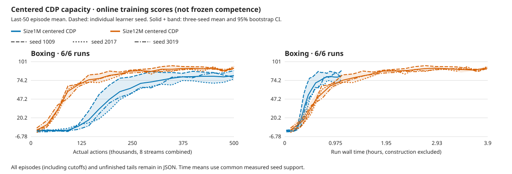

# Boxing's larger-model advantage is modest and inconsistent across seeds

**Size12M reaches frozen mean85.26 versus Size1M's77.69 at500k actions per
learner. Both sizes win72/72 selected matches.** Two larger-model seeds improve
their score;1009 declines slightly. The paired gain is+7.57 with a coarse95%
interval of[−1.29,20.71], including zero. Training costs3.57× as much wall time.
All three12M seeds pass the historical gate, but none reaches99.61. This is not
DreamerV3 parity or completion of the five-game goal.

Boxing's part of the [declared allocation](../experiments/2026-10-07-cdp-12m-four-game-capacity.md)
finishes October9 at **04:20 UTC**. Independent CPU review passes in15.17s with
no additional GPU work or game actions. Freeway continues unchanged.
[Compact data](2026-10-09-cdp-boxing-capacity.json),
[full review](../../runs/cdp-12m-four-20261007.iEvfk9Vm/boxing-capacity-review.json),
[review script](../../runs/cdp-12m-four-20261007.iEvfk9Vm/review_game.py).

## Scores and cost

Frozen evaluation selects each stream's first three natural episodes, eight
streams, sampled policy and zero learning. Intervals resample the three learner
seeds, not episodes; with three seeds they are coarse.

| Seed | Retained1M frozen |12M frozen | Actual12M initial |12M wins |12M online last50 |
| --- | ---: | ---: | ---: | ---: | ---: |
|1009 |74.46 |73.17 |1.83 |24/24 |91.38 |
|2017 |71.63 |92.33 |3.25 |24/24 |94.42 |
|3019 |87.00 |90.29 |0.79 |24/24 |90.12 |
| Mean / total |77.69 |85.26 |1.96 |72/72 |91.97 |

Paired score differences are−1.29/+20.71/+3.29. The12M mean interval is
[73.17,92.33]. All learners improve over their actual initial weights, which
win41/72 matches with near-zero mean margin. All12M and retained1M learners
pass the original≥90% wins/mean≥50 gate; the99.6133 long-run reference remains
unmet. Online last50 scores are not frozen scores:1009's91.38 online does not
replace its73.17 frozen result.

Three fresh learners add **1.5M actions,5,997,370 emulator frames,374,817 updates
and11h41m33s training**. Retained1M training costs3h16m29s in total.
Frozen collection adds212,288 actions. Earlier learning, diagnostics,
qualification and interrupted work remain additional cost.
No video prior or checkpoint lifetime resume is used.

Dashed curves retain all six learners. Solid curves and95% bands use equal
learner weight. Every50th common measured action point plus the last, and every
common-time point, are shown; full grids and episodes remain in raw reports.
These are online last50 means, not frozen evaluation. No extrapolation extends
the shorter1M runs; an equal-compute advantage is untested.

## Scope and checks

The whole1M→12M preset grows CNN, embedding, RSSM, policy and exploration
ensemble together, totaling16,334,353 actual trainable parameters. Learning
configuration otherwise matches. Runtime also changes from retained
6d38eea2/Meganeurac6376542 to83be73bf/f104f354, Bladee349cddf unchanged.
The [qualified refresh](2026-10-07-meganeura-control-refresh.md) does not prove
universal trajectory parity. This is not an exact same-binary capacity ablation
or an isolated encoder test; no mid-allocation rebuild.

Same centered CDP/action-effects recipe, N8/B8/T16/H15/R32 and full18/sticky.25/
repeat4/no reset no-ops. Native pixels receive one GPU RGB64 resize. No action
hint, actor-side diagnostic observer, externally shaped reward, new loss or
video pretraining. Full rates/configuration remain in the declaration.

All **nine guards,144 selected natural frozen episodes, exact346 tensors/model
and six whole replay/video checks pass**. Zero selected cutoffs or frozen
updates. Seven excess episodes, every unfinished tail and eleven standalone
allocation warnings remain. Source pins, finite checkpoints, actual-initial
identities, exact124,939 updates/learner and zero training debt pass.
No recorded API/numerical/hard fault, separate NVML polling or recovery.

The CPU review rereads records, independently selects natural cohorts, verifies
tensor equality and video hashes/frame counts/rates, and recomputes summaries
and curves. Natural-match wins are joined to those exact selected episodes from
the existing full replays. Development evaluation seeds are reused from the1M
controls, not an untouched test. Our500k actions are approximately2M frames,
versus the [reference's200M](2026-10-05-dreamerv3-five-game-reference.json);
online/frozen protocols and windows differ. No exact benchmark parity or
matched RGB compute-saving claim.

## Decision

Retain both sizes. Unlike the consistent paired reward gains on Breakout,
Pong and Qbert, Boxing does not establish a consistent larger-model advantage
at this budget. Both presets already pass its historical gate, and the larger
model has not closed the remaining quality gap. This result alone does not
justify its extra compute.

Finish the already declared Freeway cohort, then review the complete five-game
capacity/cost comparison before another learning allocation. No Boxing extension,
larger model or representation sweep.12M prior forecasts remain untested.
Mean updates110.07ms spend55.4% in imagination,29.9% world training and9.2%
posterior; GPU utilization remains unmeasured. All five long-run targets and
the budget question remain open.

## Whole rollout videos

Whole stream-zero videos include excess episodes and unfinished tails; reported
scores cover all eight streams. Links require the local workspace, not GitHub
downloads.

| Seed | Trained | Actual initial |
| --- | --- | --- |
|1009 | [whole rollout](../../runs/cdp-12m-four-20261007.iEvfk9Vm/boxing-centered-1009-candidate-frozen.mp4) | [whole control](../../runs/cdp-12m-four-20261007.iEvfk9Vm/boxing-centered-1009-untrained-frozen.mp4) |
|2017 | [whole rollout](../../runs/cdp-12m-four-20261007.iEvfk9Vm/boxing-centered-2017-candidate-frozen.mp4) | [whole control](../../runs/cdp-12m-four-20261007.iEvfk9Vm/boxing-centered-2017-untrained-frozen.mp4) |
|3019 | [whole rollout](../../runs/cdp-12m-four-20261007.iEvfk9Vm/boxing-centered-3019-candidate-frozen.mp4) | [whole control](../../runs/cdp-12m-four-20261007.iEvfk9Vm/boxing-centered-3019-untrained-frozen.mp4) |
