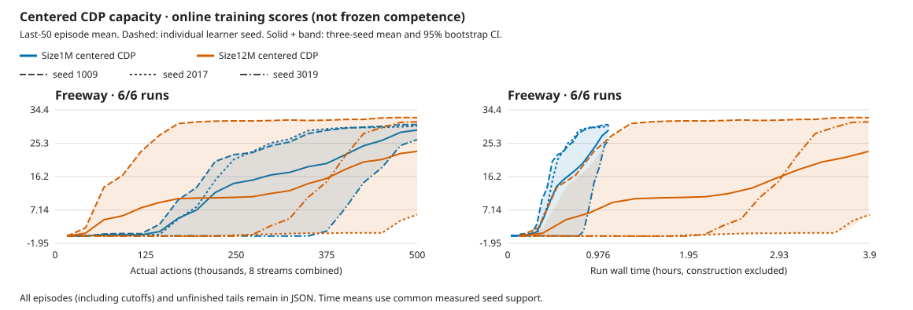

# Freeway closes the 12M comparison: larger is not universally better

**Freeway's12M frozen mean is27.54 versus retained1M30.26.** Two seeds improve,
but2017 regresses substantially. The paired difference is−2.72 [−13.29,4.08];
three learner seeds give a coarse interval that includes zero. This is not a
reliable capacity advantage, and the33.40 long-run reference remains unmet by
the cohort. Keep the stronger first seed and the regression together.

The [fixed allocation](../experiments/2026-10-07-cdp-12m-four-game-capacity.md)
finishes October9 at **16:08:01 UTC**, after47h1m32s for its twelve pairs.
The automatic CPU cohort/combined review finishes at16:12:35; no learner or
review worker remains. [Freeway data](2026-10-09-cdp-freeway-capacity.json),
[five-game comparison](2026-10-09-cdp-five-game-capacity.json),
[raw cohort review](../../runs/cdp-12m-four-20261007.iEvfk9Vm/freeway-capacity-review.json).
The five-game quality goal and the RGB compute-saving question stay open.

## Scores, task completion and learning curve

Each learner gets500k actions/124,939 updates. Frozen scores select the first
three natural episodes per stream across eight streams, without learning.
Task success means at least25 crossings in a natural round, not merely a
positive return. Initial controls are each learner's actual zero-experience
weights, not independently reinitialized models.

| Seed | Retained1M frozen |12M frozen | Actual initial |12M online last50 | Rounds meeting25 crossings1M→12M |
| --- | ---: | ---: | ---: | ---: | --- |
|1009 |29.50 |33.58 |0 |32.28 |24/24→24/24 |
|2017 |30.54 |17.25 |0 |5.86 |24/24→0/24 |
|3019 |30.75 |31.79 |0 |31.10 |24/24→24/24 |
| Mean / total |30.26 |27.54 |0 |23.08 |72/72→48/72 |

All three models improve over their actual initial controls. Only1009/3019
pass the historical crossing gate.1009's frozen mean exceeds the descriptive
33.3993 reference, but its online32.28 does not; one seed is not cohort-level
parity, and published protocols/windows differ.

2017 is weak through most of training: its online curve is0 near200k actions,
.88 near400k and5.86 at500k. It earned an early crossing but did not rapidly
turn that into sustained progress. Its better final frozen17.25 is not evidence
that a formerly strong policy collapsed. The curve alone identifies neither
a GPU fault nor a specific representation/exploration cause. Retain the weak
seed; do not tune a Freeway-only gate or silently extend its budget.

Solid curves show equal-seed online means and learner-seed bootstrap intervals;
dashed curves retain all six learners. These are not frozen evaluations or
episode-level confidence intervals. All raw points remain retained; the figure
uses the established deterministic thinning and does not extrapolate the
shorter1M runs to the12M wall time.

## Cost and checks

The three new learners cost **1.5M actions,5,999,880 emulator frames,374,817
updates and11h41m22s training**. Retained1M costs3h16m30s, so12M takes3.57×
as long at the same interaction budget. Mean update109.94ms;55.5% is imagination
and29.8% world training. GPU utilization remains unmeasured.

All nine guards,144 selected natural episodes, exact346 saved tensors/model,
zero frozen updates and all six full trajectory/video checks pass. Frozen
collection adds294,912 actions; no excess completed episodes, but every
unfinished tail remains. Thirteen standalone allocation warnings are retained.
No recorded API/numerical/hard fault or recovery; no separate NVML polling.
The CPU completion service uses16.22 CPU seconds and414.7MiB peak across its
wait, remaining seed reviews and final cohort/suite review, with zero new
game actions or actor updates. Its7h35m wall lifetime is mostly waiting, not
extra training or diagnostic compute.

The first suite-publication check stops on two Pong reference averages differing
by at most1.8e-15 under a different summation order; all source scores match.
The corrected check reproduces the declared left-to-right reduction exactly,
without changing data or tolerances. The [failed validator and diagnosis](../../runs/cdp-12m-four-20261007.iEvfk9Vm/publication-summation-failure.json)
remain; no learner or evaluation is repeated.

Same centered CDP/action-effects coefficient1, N8/B8/T16/H15/R32, microbatch8,
replay100000, cosine500, encoder6e-6/dynamics4e-4/base4e-5, AGC.3 and
ac_grads=false. Full18/sticky.25/repeat4, no reset no-ops, native pixels and one
GPU RGB64 resize; no action hint, external reward shaping or video prior.
Whole-model capacity changes, not an isolated CNN/RSSM/ensemble ablation.
Actual larger-model parameter count is16,334,353 including exploration.

New learning uses native83be73bf/Meganeuraf104f354/Bladee349cddf. Retained1M
controls use6d38eea2/c637; the backend qualification does not retroactively
repin them. This is not an exact same-binary capacity ablation. Evaluation
reuses the declared development seed base4,000,000,000+learner seed, not an
untouched test suite. The original failed reporting source and historical
Breakout cohort repair remain in their earlier reports.

## Complete five-game conclusion

All fifteen12M learners now have final/actual-initial frozen evaluations.
The separately completed Breakout cohort retains its earlier qualified backend.

| Game |1M frozen mean |12M frozen mean | Paired change [95% learner-seed interval] | Training wall ratio |
| --- | ---: | ---: | --- | ---: |
| [Boxing](2026-10-09-cdp-boxing-capacity.md) |77.69 |85.26 |+7.57 [−1.29,20.71] |3.57× |
| [Pong](2026-10-08-cdp-pong-capacity.md) |4.54 |12.40 |+7.86 [1.04,18.25] |3.57× |
| Freeway |30.26 |27.54 |−2.72 [−13.29,4.08] |3.57× |
| [Breakout](2026-10-07-cdp-capacity.md) |5.14 |38.21 |+33.07 [12.38,44.17] |3.58× |
| [Qbert](2026-10-08-cdp-qbert-capacity.md) |993.75 |2,657.99 |+1,664.24 [435.42,3,823.96] |3.51× |

Total12M training: **7.5M actions/29,989,286 frames/1,874,085 updates/58h22m14s**,
versus retained1M16h24m7s: **3.56×** the training wall time. All45 guards,
720 selected natural frozen episodes, unchanged saved tensors and30 whole
replays/videos pass. Frozen collection adds1,069,184 actions with zero updates;
all35 excess episodes, tails and52 allocation warnings remain. Earlier
development, qualification, probes and interrupted work are additional costs,
not included in these totals.

Capacity helps every paired reward mean on Breakout/Pong/Qbert, not every game
or task milestone. Boxing wins were already72/72 at1M; Qbert's first-pyramid
successes still come only from3019; Freeway loses reliability. Keep12M as the
quality candidate and1M as the fast control, without universal promotion,
another capacity sweep or a claim that the current representation is solved.

At approximately2M frames, current12M **online** means versus all released
DreamerV3 online-bin means are Boxing91.97/89.82, Pong11.91/−7.16,
Freeway23.08/2.13, Breakout37.59/12.73 and Qbert2,600.33/2,665.04. These
[reference values](2026-10-09-cdp-five-game-capacity.json) retain all released
seeds and fixed2M/4M/8M bins. They argue against a broad same-experience
regression, not for exact parity or CDP superiority. The unchanged targets
remain99.61/20.45/33.40/381.81/193,220.77 from the last10% of200M frames.

Next: qualify the newly reviewed upstream backend on unchanged learning
graphs and make one matched12M timing before choosing another learning
allocation. Blade descriptor reuse is a plausible overhead improvement,
not a measured speedup or an explanation for2017. The rejected projection
rewrite stays rejected.12M prior forecasts remain untested; there is no
matched five-game RGB compute-saving result or automatic learning extension.

## Whole rollout videos

Full stream-zero replays, including unfinished tails; scores cover all eight
streams. These local files are not GitHub-hosted downloads.

| Seed | Trained | Actual initial |
| --- | --- | --- |
|1009 | [whole rollout](../../runs/cdp-12m-four-20261007.iEvfk9Vm/freeway-centered-1009-candidate-frozen.mp4) | [whole control](../../runs/cdp-12m-four-20261007.iEvfk9Vm/freeway-centered-1009-untrained-frozen.mp4) |
|2017 | [whole rollout](../../runs/cdp-12m-four-20261007.iEvfk9Vm/freeway-centered-2017-candidate-frozen.mp4) | [whole control](../../runs/cdp-12m-four-20261007.iEvfk9Vm/freeway-centered-2017-untrained-frozen.mp4) |
|3019 | [whole rollout](../../runs/cdp-12m-four-20261007.iEvfk9Vm/freeway-centered-3019-candidate-frozen.mp4) | [whole control](../../runs/cdp-12m-four-20261007.iEvfk9Vm/freeway-centered-3019-untrained-frozen.mp4) |
